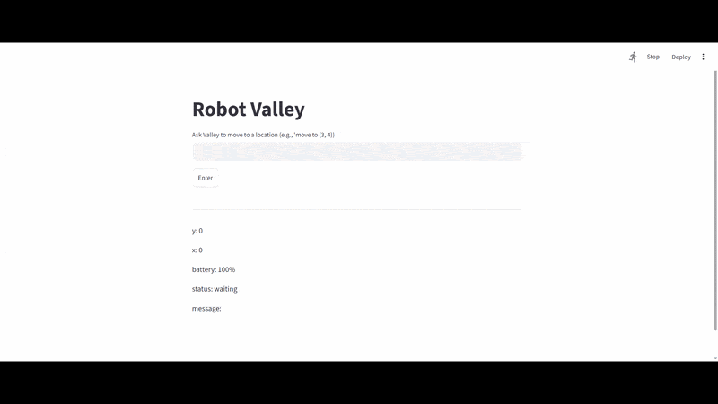

# AI robot Valley.
This project is a way of interactive control of a robot named Valley.
The projects is written in Python language, using LLM ("gpt-4o-mini") to translate natural human speach into clear commands for the bot.
Valley can move forward, back, left and right ("for example: move forward steps", steps", rove to (5,5), go back 2 steps, etc.")
Valley has a battery, if there,s a risk of it running out, Valley will return back to the base.

---

# Project architecture. 3 files.
1. robot.py (using python) is a draft of a robot, it's running an infinate loop asking for new coordinates.
2. serwer.py (using FAST API) is a place connecting the serwer to LLM, getting responses, stripping them to a dictionary and giving to the robot.py 
3. frontend.py (using Streamlit) is the page interface, showing all current metrics of the robot and allowing easier access of the robot to the user.

---

# Run the project.
Create a .env file and add your OpenRouter AT API_KEY.
Use those commands:
1. uvicorn server:app --reload 
2. python robot.py
3. streamlit run frontend.py   

## Demo
 

## Full video
Full project presentation video: https://app.airtimetools.com/recorder/s/z_6JgE2BbaHNdYueJL1H0m